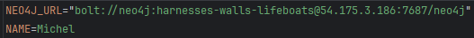
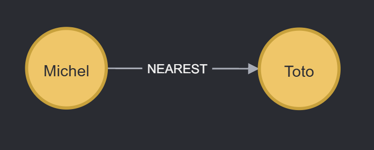

# FR

## Fix démo

Désormais en mettant bien votre nom dans le `.env` à `NAME` 

Ensuite, vous lancez le programme et vous aurez ce résultat *(si vous mettez "Toto" pour le prénom de votre voisin)* : 

# EN

## Demo Fix

Now, by setting your name in the `.env` file to `NAME` 

Then, run the program, and you'll get this result *(if you set "Toto" to your neighbor's first name)*: 
